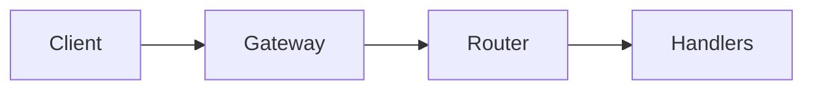

# distributed-api-services

Go-based API service playground for gateway routing and service boundary evolution.

## Why This Exists

To show practical distributed-service foundations with explicit contracts and testable endpoints.

## Architecture



## Project Layout

- `src/gateway/` ingress service
- `src/internal/router/` route registration
- `src/internal/handlers/` endpoint logic
- `docs/` architecture + ADRs

## Usage

```bash
go test ./...
```

## Roadmap

- Add user/order service endpoints
- Add service-to-service request contracts
- Add trace IDs and structured logging
