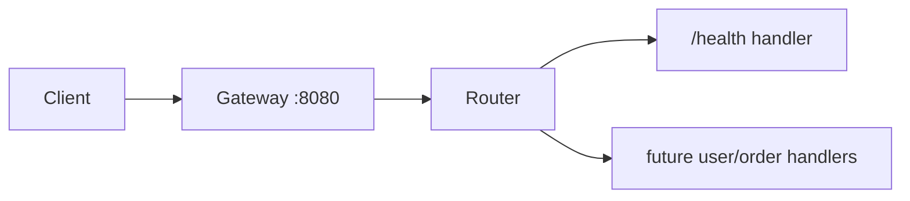

# Architecture

## Service Topology

- `gateway`: ingress point and composition layer.
- `internal/router`: routing assembly.
- `internal/handlers`: protocol-facing endpoint handlers.

## Evolution Path

- Add service-to-service transport contracts.
- Introduce request-scoped tracing and structured logs.
- Split handler packages by bounded context.
